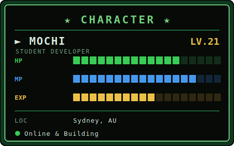

<div align="center">

# 🎮 PLAYER: MOCHI 🎮

<b>🕹️ Pixel Game Developer &nbsp;·&nbsp; 🎨 AI Artist &nbsp;·&nbsp; 👾 Godot Explorer</b>


</div>

---

## 📊 STATS

<div align="center">
  
</div>

---

<div align="center">
  
</div>

## 🎒 INVENTORY

```text
🎮 Godot Engine     ⚙️ C Language       🐧 Linux
🎨 Pixel Art        🤖 AI Tools         🌐 Web Development
```

<p align="center">
  
</p>

---

## 🎴 FEATURED PROJECT

### 🎮 Pixel AI Generator

> Generate retro pixel-art characters with AI.

---

## 📫 CONTACT

<p align="center">
  <a href="mailto:3234208868@qq.com">
    
  </a>
</p>

---

<div align="center">

```text
⭐ Thanks for visiting my dungeon — GG! ⭐
```

</div>
